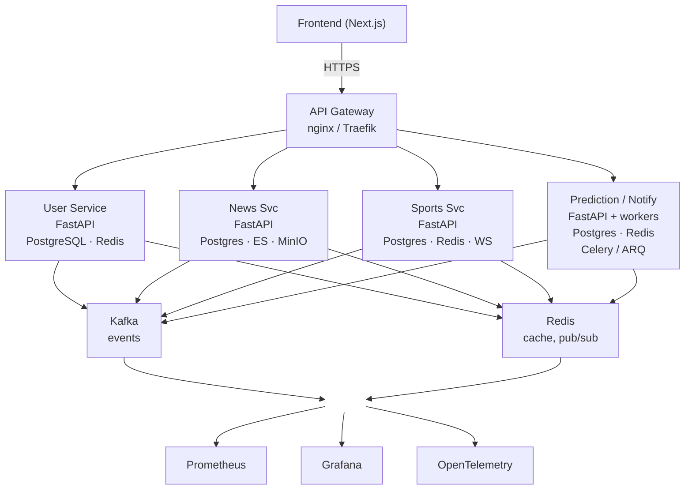

# sport_pari

Общая ветка `main` — точка слияния сервисных веток. Каждый работает в своей ветке и вливает её в `main`.

## Архитектура

Клиент ходит в API Gateway по HTTPS. Gateway разводит запросы по четырём сервисам. Сервисы публикуют события в Kafka и используют общий Redis для кэша и pub/sub. Метрики и трейсы собирают Prometheus, Grafana и OpenTelemetry.

Шлюз на схеме — **nginx / Traefik**. Допустимый вариант края: **FastAPI + httpx** как reverse-proxy, либо **Traefik** как edge.

## Сервисы

| Сервис | Стек |
| --- | --- |
| User Service | FastAPI, PostgreSQL, Redis |
| News Svc | FastAPI, Postgres, Elasticsearch, MinIO |
| Sports Svc | FastAPI, Postgres, Redis, WebSocket |
| Prediction / Notify | FastAPI и воркеры, Postgres, Redis, Celery или ARQ |

Общая инфраструктура: Kafka (события), Redis (кэш и pub/sub), Prometheus, Grafana, OpenTelemetry.
